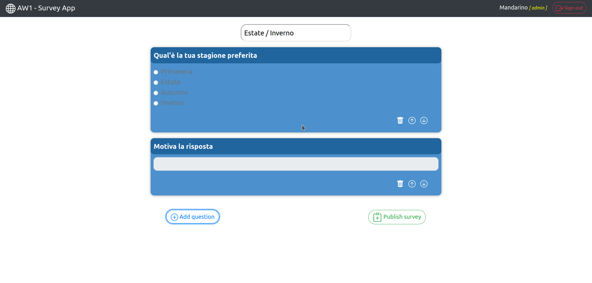

#  Exam #1: "Questionario"
## Student: s292482 GALLIANO GIACOMO 
 
## React Client Application Routes
 
-  Route: `/`: root address. Used to render all the addresses t hat are not corresponding to the defined ones.
-  Route: `/login`: login page. Used by admin users to sign in.
-  Route: `/main_page`: *guest users* main page. Used to show t he available surveys.
-  Route: `/survey`: survey's compile page.
-  Route: `/admin/main_page`: admin's main page. It shows the a dmin's surveys and the number of answers.
-  Route: `/admin/survey/results`: survey's result page. It lets t he admin visualize the user's answers to a specific survey
-  Route: `/admin/create_survey`: survey's creation page. It's w here the admin can create a new survey.
 
 
# # API Server
 
### Load all the surveys
- URL: `/api/surveys`
 
- Method: `GET`
 
- Description: Load all the surveys available in the database.
 
- Request body: none.
 
- Request query parameter: none.
 
- Response: `200 OK` (success), `500 Internal Server Error` -( generic error).
 
- Response body: an array of objects, each oh them describing a s urvey.
 
```
[ {
" id":3,
" title": "UEFA Euro 2020 statistics",
" adminId":1,
" NoA":1
} 
. ..
] 
```
 
### Load all the surveys for a specific admin
- URL: `/api/admin/surveys`
 
- Method: `GET`
 
- Description: Load all the surveys available in the database r elated to the given admin.
 
- Request body: none.
 
- Request query parameter: none.
 
- Response: `200 OK` (success), `404 Not Found` (admin not found),  `500 Internal Server Error` -(generic error).
 
- Response body: an array of objects, each oh them describing a s urvey.
 
```
[ {
" id":3,
" title": "UEFA Euro 2020 statistics",
" adminId":1,
" NoA":1
} 
. ..
] 
```
 
### Load answers and questions for a specific survey
- URL: `/api/survey/:surveyId`
 
- Method: `GET`
 
- Description: Load all the questions and answers related to the g iven survey.
 
- Request body: none.
 
- Request query parameter: `surveyId`.
 
- Response: `200 OK` (success), `500 Internal Server Error` -( generic error).
 
- Response body: an array of objects, each oh them describing a s urvey with its questions and answers.
 
```
[ 
   {"idQuestion":3,
   "idAnswer":1,
   "min":1,
   "max":1,
   "question":"Which of these teams is the favourite to win the  UEFA Euro 2020 competition?",
   "answer":"Italy"}
. ..
] 
```
 
### Load results and questions for a specific survey
- URL: `/api/admin/survey/:surveyId/results`
 
- Method: `GET`
 
- Description: Load all the questions and the results related to t he given survey.
 
- Request body: none.
 
- Request query parameter: `surveyId`.
 
- Response: `200 OK` (success), `500 Internal Server Error` -( generic error).
 
- Response body: an array of objects, each oh them describing a s urvey with its questions and results. It contains the ` guestName` and the iinformations about every answer of the s urvey.
 
```
[ {"idGuest":4,"results":[{"idQuestion":1,"idAnswer":1," answer":"","selected":"Germany"},{"idQuestion":2,"idAnswer":1," answer":"","selected":"Italy"}
. ..
] 
```
 
### Set Results
-  URL: `/api/admin/survey/results/set`
 
- Method: `POST`

- Description: Create a new result in the table RESULTS, collecting all the answers of the survey.

- Request body: An object representing a result (Content-Type: application/json).

```
{
  "surveyId":5,
  "guestName":"Johnny",
  "results":
      [{"idQuestion":1,
        "idAnswer":1,
        "answer":"si",
        "selected":false
        },
        {
        "idQuestion":1,
        "idAnswer":2,
        "answer":"si",
        "selected":false
        },
        ...
```

- Response: `201 Created` (success, the result has been inserted), `401 Unauthorized` (user unauthorised), `422 Unprocessable Entity` (validation of req params failed), `503 Service Unavailable` (The server cannot handle the request, database error).

- Response body: none.

### Create survey
- URL: `/api/admin/survey/create`

- Method: `POST`

- Description: Create a new survey with all the questions and answers.

- Request body: An object representing a survey (Content-Type: application/json).

```
{
  "adminId":1,
  "title":"Climate change",
  "questions":
      [{"idQuestion":1,
      "question":"Are you aware of climate change?",
      "min":1,
      "max":1
      },
      ...
```

- Response: `201 Created` (success, the result has been inserted), `401 Unauthorized` (user unauthorised), `422 Unprocessable Entity` (validation of req params failed), `503 Service Unavailable` (The server cannot handle the request, database error).

- Response body: none.


## User management API 

#### Login

- HTTP method: `POST`  URL: `/api/sessions`
- Description: autentica l'admin che sta cercado di accedere
- Request body: le credenziali dell'admin

``` 
{
   "username":"john.doe@polito.it","password":"123ciao"}
}
```

- Response: `200 OK` (success)
- Response body: authenticated user

``` 
{
    "id": 1,
    "username": "john.doe@polito.it", 
    "name": "John"
}
```
- Error responses:  `500 Internal Server Error` (generic error), `401 Unauthorized User` (login failed)


#### Check if user is logged in

- HTTP method: `GET`  URL: `/api/sessions/current`
- Description: controlla se l'admin è loggato e prende i suoi dati.
- Request body: _None_
- Response: `200 OK` (success)-
- Response body: admin autenticato

``` 
{
    "id": 1,
    "username": "john.doe@polito.it", 
    "name": "John"
}
```

- Error responses:  `500 Internal Server Error` (generic error), `401 Unauthorized User` (user is not logged in)


#### Logout

- HTTP method: `DELETE`  URL: `/api/sessions/current`
- Description: logout admin corrente
- Request body: _None_
- Response: `200 OK` (success)-
- Response body: _None_-
- Error responses:  `500 Internal Server Error` (generic error), `401 Unauthorized User` (user is not logged in)

## Database Tables

- #### SURVEY

|***id_survey***|id_admin|title|NoA|
--- | --- | --- | ---
--- | --- | --- | ---

- #### QUESTIONS

|***id_question***|***id_survey***|question|min|max|
--- | --- | --- | --- | ---
--- | --- | --- | --- | ---

- #### RESULTS

|***id_guest***|id_survey|results|guest_name|
--- | --- | --- | --- 
--- | --- | --- | --- 

- #### POSSIBLE ANSWERS

|***id_survey***|***id_question***|***id_answer***|answer|
--- | --- | --- | ---
--- | --- | --- | ---

- #### ADMINISTRATORS

|***id_admin***|email|name|hash|
--- | --- | --- | ---
--- | --- | --- | ---

## Main React Components

- `MainPage` (in `MainPage.js`): main page that shows all the surveys available (used for both admin and guest mode)
- `SurveyPage` (in `SurveyPage.js`): page used to compile or see the result of a survey
- `CreateSurveyPage` (in `CreateSurveyPage.js`): page used by the admin to create a survey
- `QAPrinter` (in `QAPrinter.js`): component used to print the survey's questions and answers
- `CreationModal` (in `CreationModal.js`): component used durin the creation of the survey.


## Screenshot



## Users Credentials

- john.doe@polito.it, `123ciao`
- manda.rino@polito.it, `123addio`

